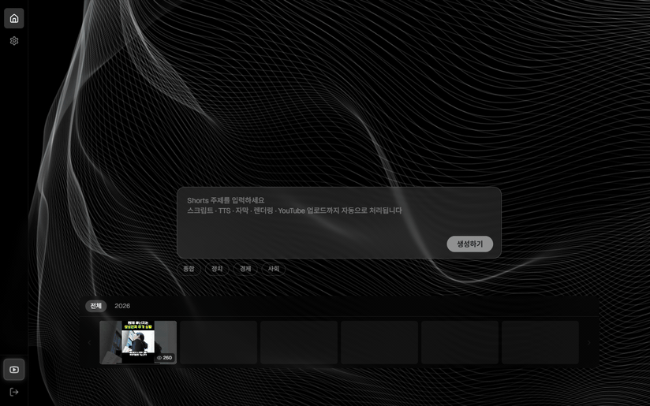

# YouTube Shorts Automation

     

토픽 입력 한 줄로 스크립트 생성 → TTS → 자막 → 영상 합성 → YouTube 업로드까지 전 과정을 자동화하는 서버리스 파이프라인.

<p align="center">
  
</p>

뉴스·시사 쇼츠 채널 특화: Google News RSS 자동 수집 → Gemini 2.5 Flash 스크립트 생성 → Edge-TTS → FFmpeg 렌더링 → YouTube 업로드.

## 파이프라인

```
POST /jobs  또는  POST /jobs/auto-news
  → script-worker  (Gemini 2.5 Flash → script.json)
  → tts-worker     (Edge-TTS          → audio.mp3)
  → subtitle-worker(스크립트 기반 SRT  → subtitle.srt)
  → render-worker  (Pexels + FFmpeg   → output.mp4)
  → upload-worker  (YouTube API       → COMPLETED)
```

## 빠른 시작

```bash
pnpm install
docker-compose up          # LocalStack + PostgreSQL + 전체 Worker 자동 기동
curl -X POST http://localhost:3000/jobs   -H "Content-Type: application/json"   -d '{"channelId": "<id>", "topic": "한국 경제 전망"}'
```

자세한 환경 세팅 → [로컬 환경 세팅 가이드](docs/onboarding/local-setup.md)

## 문서

| 영역 | 링크 |
|---|---|
| 시작하기 | [로컬 환경 세팅](docs/onboarding/local-setup.md) · [API 키 발급](docs/onboarding/api-keys.md) · [환경변수](docs/onboarding/env-vars.md) · [개발 명령어](docs/onboarding/commands.md) |
| 아키텍처 | [개요](docs/architecture/overview.md) · [파이프라인](docs/architecture/pipeline-flow.md) · [데이터 모델](docs/architecture/data-model.md) · [프로젝트 구조](docs/architecture/project-structure.md) |
| 제품 | [PRD](docs/prd.md) · [Roadmap](docs/roadmap.md) · [비즈니스 규칙](docs/product/business-rules.md) |
| 개발 | [개발 컨벤션](docs/backend/conventions.md) · [ADR 목록](docs/adr/README.md) |
| 운영 | [배포 절차](docs/operations/runbook/deploy.md) · [모니터링](docs/operations/monitoring.md) |

전체 문서 인덱스 → [docs/README.md](docs/README.md)

## 라이선스

MIT
